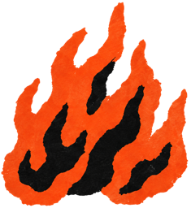
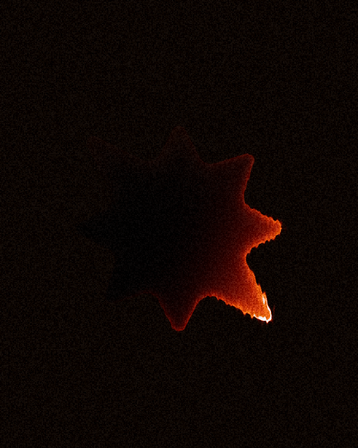

<p align="center">
  
</p>

<h1 align="center">Fayaaa</h1>

<p align="center">
  <strong>Turn images, text, and marks into living fire.</strong><br />
  A shape-aware WebGPU shader playground that runs entirely in the browser.
</p>

<p align="center">
  <a href="LICENSE"></a>
  
  
</p>

<p align="center">
  
</p>

## What is Fayaaa?

Fayaaa is a hands-on creative playground for applying a living fire material to a real
silhouette. Upload an image, type a word, or start with a sample mark; then shape the
direction, heat, color, motion, and composition while the shader runs in real time.

There are two image treatments:

- **Burn through** turns the subject itself into the Fayaaa material.
- **Burn around** keeps the image core visible while fire travels along its boundary.

Uploads never leave the browser. The active subject and background are stored locally so
refreshing the page does not break the composition.

## Playground

- Image and directly editable text subjects
- Shape-aware alpha, bright, and dark mask inference
- Fire direction, intensity, spread, inside glow, sharpness, and motion controls
- Normal, Screen, Add, Multiply, and Overlay blending
- Fire, Violet, and Mint palettes plus custom subject and background colors
- Color, image, or transparent backgrounds
- Source comparison, pause, sound, intro replay, and reduced-motion support
- Flattened PNG export
- Three-second WebM export at 16:9, 1:1, or 9:16; 24, 30, or 60 FPS

“Reset to default” resets the shader parameters only. It preserves the subject, uploaded
assets, background, palette, and color choices.

## How it works

```text
image / text
    ↓
mask inference
    ↓
anti-aliased jump flooding
    ↓
signed-distance field
    ↓
Fayaaa WGSL material
    ↓
live canvas / PNG / WebM
```

The pipeline builds a signed-distance field from the supplied shape, then composites the
fire in WGSL. The original subject texture is sampled inside WebGPU when Burn around is
active, so the final image remains one coherent render rather than stacked DOM layers.

## Run locally

Fayaaa uses pnpm and a current WebGPU-capable browser.

```bash
pnpm install
pnpm dev
```

Open [http://localhost:5173](http://localhost:5173).

## Quality checks

```bash
pnpm test       # interaction and shader contracts
pnpm typecheck  # strict TypeScript
pnpm check      # WGSL composition and reflection checks
pnpm build      # production build
```

For device-backed validation on a machine with a WebGPU adapter:

```bash
pnpm test:gpu
pnpm check:gpu
pnpm doctor
```

The default WGSL check still resolves imports, reflects bindings, and reports diagnostics
without a GPU. The `:gpu` commands require a real adapter and make device validation a hard
failure.

## Project structure

```text
src/          UI, WebGPU pipeline, persistence, exports, and shaders
shared/       canonical Fire parameters and presets
test/         behavior, presentation, mask, and rendering checks
public/       static assets and fallback media
scripts/      local validation helpers
experiments/  isolated visual studies
```

The canonical material lives in [`src/shaders/fayaaa.wgsl`](src/shaders/fayaaa.wgsl). The
playground compositor, mask passes, and jump-flood pipeline live beside it in
[`src/shaders`](src/shaders).

## Contributing

Issues and focused pull requests are welcome. Please run the four default quality checks
before opening a PR, and include a short screen recording for changes that affect the
shader or interaction behavior.

## License

Fayaaa is available under the [MIT License](LICENSE).
